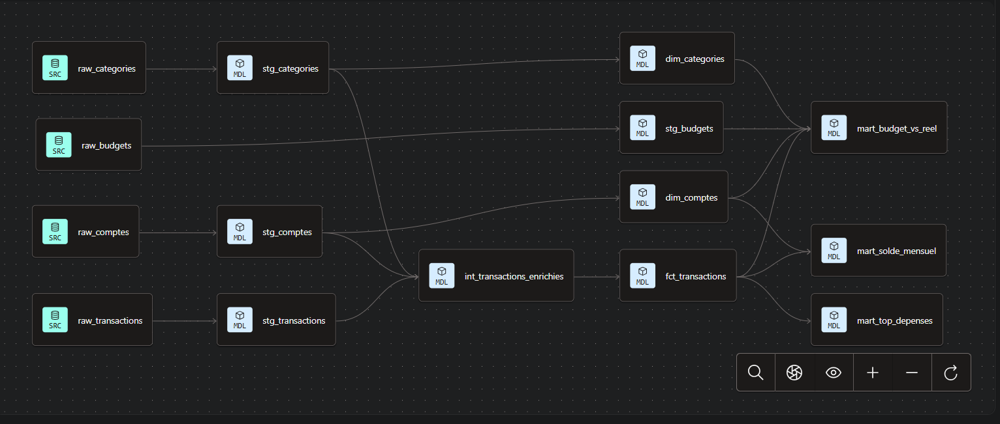

# ❄️ FinTrack Analytics — Snowflake + dbt (niveau débutant)

Pipeline analytique pour **FinTrack**, une fintech de gestion de finances personnelles : transformation de données brutes de comptes, transactions, catégories et budgets en modèles analytiques fiables, testés et documentés avec **dbt** sur **Snowflake**.

## Contexte

FinTrack collecte des données sur les comptes bancaires de ses utilisateurs, leurs transactions quotidiennes, les catégories de dépenses et les budgets définis par client — mais jusqu'ici stockées en vrac, sans transformation. Ce projet met en place la première couche d'un entrepôt de données structuré, capable d'alimenter des tableaux de bord financiers fiables.

## Lineage du pipeline



`raw_*` (sources) → `staging` (nettoyage 1:1) → `intermediate` (enrichissement) → `marts` (dimensions & faits consommés par la BI)

## Architecture

| Couche | Matérialisation | Rôle |
|---|---|---|
| `staging/` | `view` | Renommage, typage et nettoyage 1:1 de chaque table source |
| `intermediate/` | `ephemeral` | Jointures et enrichissements, injectés en CTE (aucun objet créé en base) |
| `marts/` | `table` | Dimensions et faits finaux, consommés par la BI |

```
fintrack_analytics/
├── models/
│   ├── staging/
│   │   ├── _stg_sources.yml        # déclaration des 4 sources raw
│   │   ├── _stg_schema.yml         # tests & documentation
│   │   ├── stg_comptes.sql
│   │   ├── stg_transactions.sql
│   │   ├── stg_categories.sql
│   │   └── stg_budgets.sql
│   ├── intermediate/
│   │   └── int_transactions_enrichies.sql
│   └── marts/
│       ├── _marts_schema.yml
│       ├── dim_comptes.sql
│       ├── dim_categories.sql
│       ├── fct_transactions.sql
│       ├── mart_solde_mensuel.sql
│       ├── mart_budget_vs_reel.sql
│       └── mart_top_depenses.sql   # bonus
├── snapshots/
│   └── snapshot_comptes.sql        # bonus — historisation SCD Type 2
├── macros/
│   └── generate_schema_name.sql    # override du schéma cible par couche
├── tests/
│   └── assert_solde_mensuel_positif.sql
├── dbt_project.yml
└── packages.yml
```

## Modèles

**Staging** — un modèle par table source (`raw_comptes`, `raw_transactions`, `raw_categories`, `raw_budgets`) : renommage des colonnes, cast des types, calcul de `montant_signe` (+crédit / −débit).

**Intermediate** — `int_transactions_enrichies` : jointure des transactions avec les comptes et les catégories, ajout de `mois_transaction`.

**Marts**
- `dim_comptes` — dimension comptes, avec `anciennete_jours` et une clé de substitution `compte_sk` (via `dbt_utils.generate_surrogate_key`)
- `dim_categories` — dimension catégories
- `fct_transactions` — table de faits des transactions **validées**
- `mart_solde_mensuel` — crédits, débits, solde net et **solde cumulé** par compte et par mois (window function)
- `mart_budget_vs_reel` — écart et dépassement entre budget prévu et dépenses réelles (`FULL OUTER JOIN`)
- `mart_top_depenses` *(bonus)* — top 3 des catégories de dépenses par compte

## Qualité des données

- **Tests génériques** (`unique`, `not_null`, `accepted_values`, `relationships`) sur les clés et colonnes critiques de chaque modèle staging et mart
- **Test singulier** `assert_solde_mensuel_positif` : aucun compte épargne ne doit avoir un solde cumulé négatif
- `dbt docs generate` : documentation et lineage complet consultables via `dbt docs serve`

## Bonus implémentés

- **`dbt-utils`** — clé de substitution (`generate_surrogate_key`) sur `dim_comptes`
- **`mart_top_depenses`** — classement des catégories de dépenses par compte (`ROW_NUMBER`)
- **Snapshot `snapshot_comptes`** — historisation SCD Type 2 (stratégie `check`) des changements de `statut`, `email` et `type_compte` sur `raw_comptes`
- **Macro `generate_schema_name`** — par défaut, dbt *suffixe* le schéma du profil (`schema: staging` → les marts atterriraient dans `STAGING_MARTS`). Cette macro fait atterrir chaque modèle dans le schéma correspondant à son dossier de premier niveau (`RAW`, `STAGING`, `MARTS`), quel que soit le schéma cible du profil actif — un besoin qui s'est révélé nécessaire dès ce projet pour garder des schémas Snowflake propres.

## Mise en route

```bash
# 1. Provisionner Snowflake (rôle, base, schémas, warehouse, tables + données d'exemple)
snowsql -f snowflake_setup.sql
snowsql -f seed_data.sql

# 2. Installer dbt et configurer la connexion (~/.dbt/profiles.yml, voir le brief PDF)
pip install dbt-snowflake
dbt debug

# 3. Construire le projet
cd fintrack_analytics
dbt deps
dbt run
dbt test
dbt snapshot        # bonus — historise raw_comptes

# 4. Documentation
dbt docs generate
dbt docs serve
```

## Stack

Snowflake · dbt-core · dbt-snowflake · [dbt-utils](https://hub.getdbt.com/dbt-labs/dbt_utils/latest/) `1.4.1`

## Rapport

Un [rapport de synthèse](RAPPORT.md) revient sur les différences entre matérialisations (`view` / `table` / `ephemeral`), l'intérêt de la séparation staging / intermediate / marts, et l'apport du test `relationships` pour l'intégrité référentielle.

---

*Projet réalisé dans le cadre d'un parcours de formation Snowflake + dbt (brief complet : [FINTRACK_projet-snowflake-dbt-finance (niveau débutant).pdf](<FINTRACK_projet-snowflake-dbt-finance (niveau débutant).pdf>)).*
